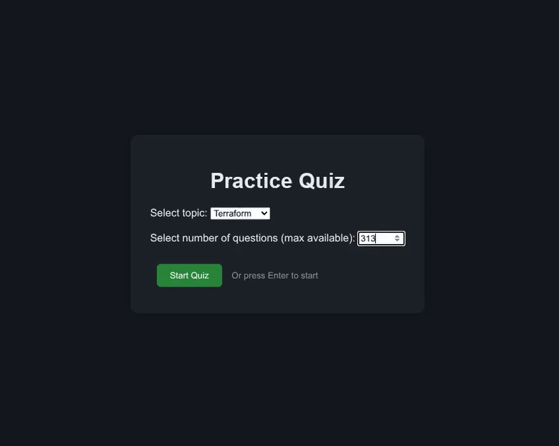

## Practice questions 

This is a collection of practice questions for some DevOps and Cloud tools. 

Currently, the available topics are:

- Terraform
- Kubernetes

The questions are stored in separate files, which are loaded dynamically when the user selects a topic.
Questions are available in single choice, multiple choice, and fill in the command formats.

## How to use

- Access the practice webpage in https://practice.c4ldas.com.br

- Select a topic and number of questions and click "Start Quiz".

- Tip: You can use the keyboard 1-9 keys to select multiple answers for multiple choice questions and Enter to submit the answer and move to the next question.

- The quiz will show the correct answer(s) after you submit your answer.

- The score will be shown at the end of the quiz.

- Enjoy the quiz!

## Example preview

## Contributing

In case you find any issues, wrong answers or have suggestions, please open an issue or a pull request. Thank you!
